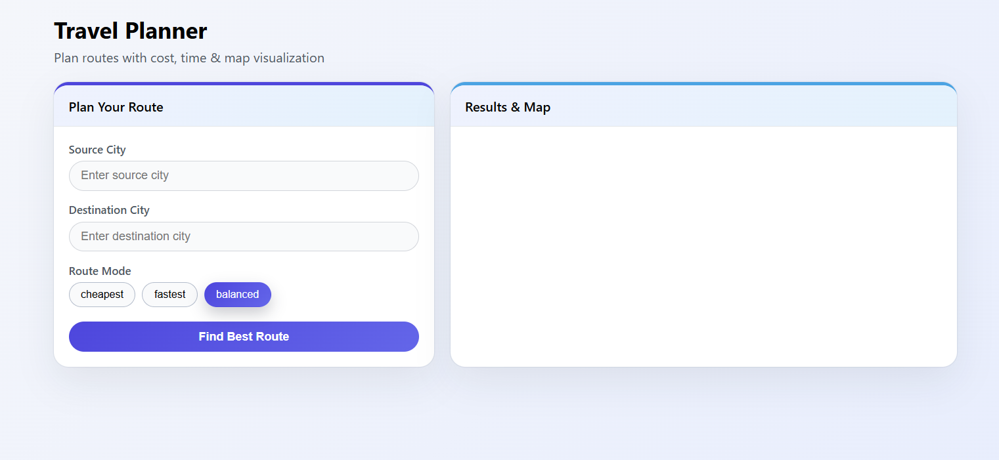
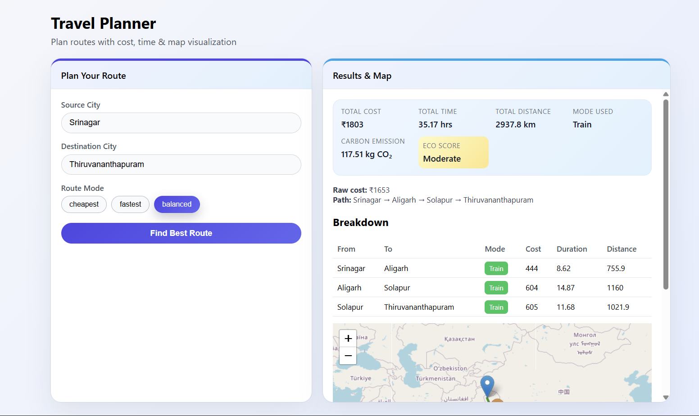
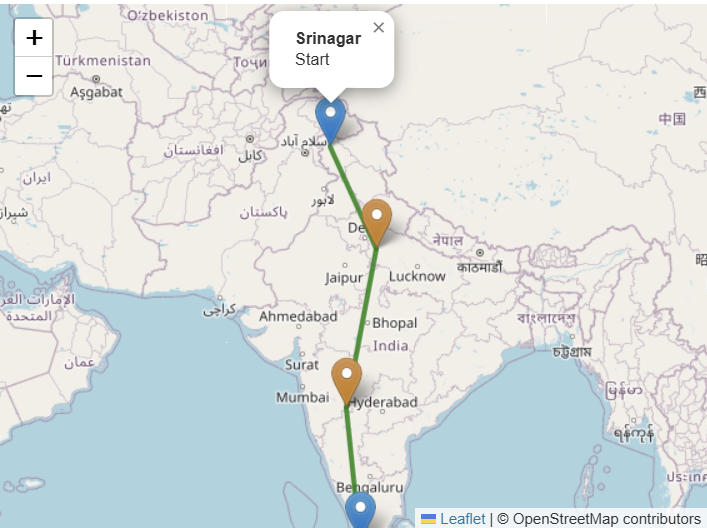

#  Travel Planner – Cost & Route Optimization Platform

A full-stack travel planning web application that helps users find the **most cost-effective, fastest, or balanced routes** between Indian cities using **graph algorithms**, real transport data, and interactive map visualization.

🔗 **Live Demo:** https://trawelplanner.netlify.app/  
🔗 **GitHub Repository:** https://github.com/harrym14/Travel-Planner 

---

##  Overview

Travel planning often involves trade-offs between **cost**, **time**, and **distance**.  
This project solves that problem by modeling real-world travel routes as a **graph**, allowing users to compute optimized routes using algorithmic decision-making.

The system analyzes multi-leg journeys and returns:
- Total cost
- Total travel time
- Distance covered
- Route breakdown
- Carbon emission & eco score
- Visual route on a map

---

##  Application Preview

###  Home & Route Input

###  Route Results & Cost Breakdown

###  Interactive Map Visualization

---

##  Key Features

-  **Cheapest Route Finder**  
  Finds the lowest-cost path between cities using graph-based shortest path algorithms.

-  **Fastest Route Finder**  
  Optimizes routes based on total travel time.

-  **Balanced Route Mode**  
  Combines both cost and time using weighted normalization.

-  **Multi-Hop Route Support**  
  Automatically handles intermediate cities and transfers.

-  **Detailed Route Breakdown**  
  Displays per-leg cost, duration, distance, and transport mode.

-  **Carbon Emission & Eco Score**  
  Estimates CO₂ emissions and assigns an environmental impact score.

-  **Interactive Map Visualization**  
  Visualizes the computed route using map markers and polylines.

-  **Deployed Full Stack Application**  
  Frontend and backend hosted independently for scalability.

---

##  How It Works (Architecture)

1. **Data Layer**
   - Travel routes stored in CSV format
   - Includes cost, duration, distance, and transport mode

2. **Backend (Flask + NetworkX)**
   - Converts route data into a directed graph
   - Applies shortest-path algorithms
   - Exposes REST APIs

3. **Frontend (React)**
   - User inputs source, destination, and optimization mode
   - Fetches results from backend API
   - Displays data, tables, and maps

4. **Deployment**
   - Frontend hosted on Netlify
   - Backend hosted on Render

---

##  Tech Stack

### Frontend
- React.js
- JavaScript (ES6+)
- HTML5, CSS3
- Leaflet.js (Map Visualization)

### Backend
- Python
- Flask
- NetworkX (Graph Algorithms)
- REST APIs
- Flask-CORS

### Data & Processing
- CSV-based route dataset
- Graph modeling
- Algorithmic optimization

### Deployment & Tools
- Netlify (Frontend Hosting)
- Render (Backend Hosting)
- Git & GitHub (Version Control)

---

##  Algorithms Used

- Dijkstra’s Algorithm (Cost Optimization)
- Weighted Shortest Path (Time Optimization)
- Normalized Multi-Criteria Scoring (Balanced Mode)

---

##  Future Enhancements

- Flight + Bus integration
- Real-time pricing APIs
- User authentication
- Route comparison charts
- Mobile-friendly UI
- ML-based price prediction

---

##  Author

**Hari Maheshwari**  
 Computer Science Engineering (AI & Data Science)  
 Passionate about Full Stack Development, Data Analytics & AI Systems

---

 If you like this project, feel free to star the repository!
